# PayWise – Spend Smart, Stay Wise
PayWise is a smart financial management application designed to help users manage their EMIs, track everyday expenses, and understand their monthly financial commitments.

## Features
- User Sign Up and Login
- Personal financial information
- Add and manage EMIs
- View EMI details and due dates
- Monthly salary and financial summary
- EMI-to-income ratio
- Remaining salary calculation
- Everyday expense tracking
- Category-wise expense tracking
- Monthly spending summary
- "What Should I Cut?" saving suggestions
- EMI payment reminders
- Profile management
- Settings

## Problem Statement
Managing multiple EMIs and everyday expenses can make it difficult to understand monthly financial commitments.
PayWise brings important financial information together in one place and presents it in a simple and organized way.

## Our Solution
PayWise helps users:
- Track their EMIs
- Monitor upcoming EMI due dates
- Understand their monthly financial commitments
- Track everyday spending
- Identify areas where they can reduce expenses
- Understand their remaining income after EMI commitments

## Technology Stack
### Frontend
- Kotlin
- Jetpack Compose
- Material 3

### Backend
- Python
- Flask

### Other Technologies
- OkHttp
- Gson
- Gradle
- Android Studio

## Application Flow
Login → Sign Up → Financial Details → Dashboard

From the Dashboard, users can access:
- My EMIs
- Add EMI
- Financial Summary
- Everyday Expenses
- What Should I Cut?
- Profile
- Settings

Screenshots
1. Logo

2. Create Account
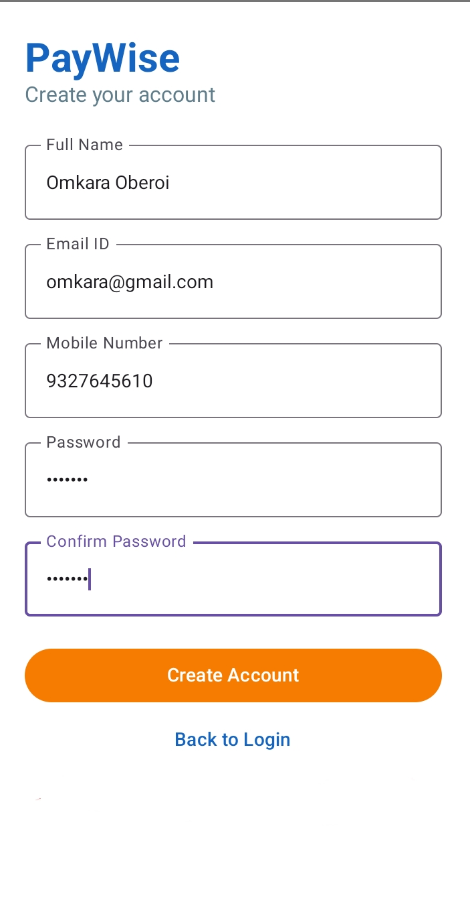

3. Login
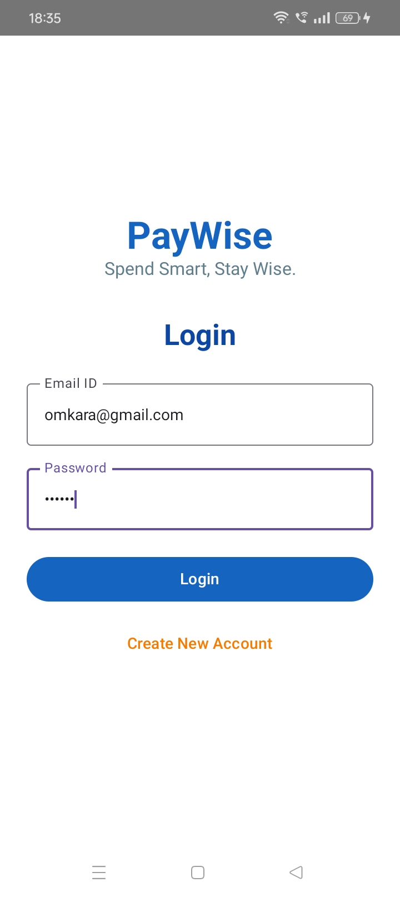

4. Dashboard
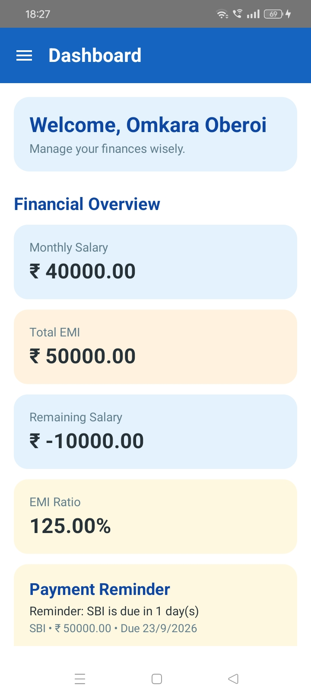

5. Dashboard – More
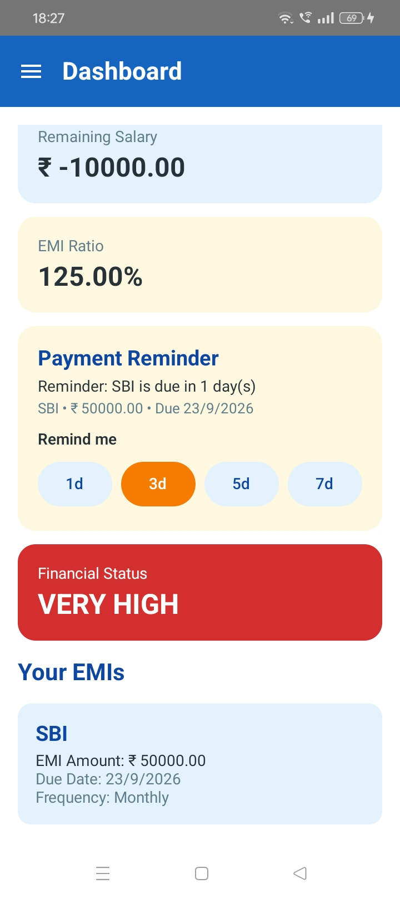

6. Add Salary
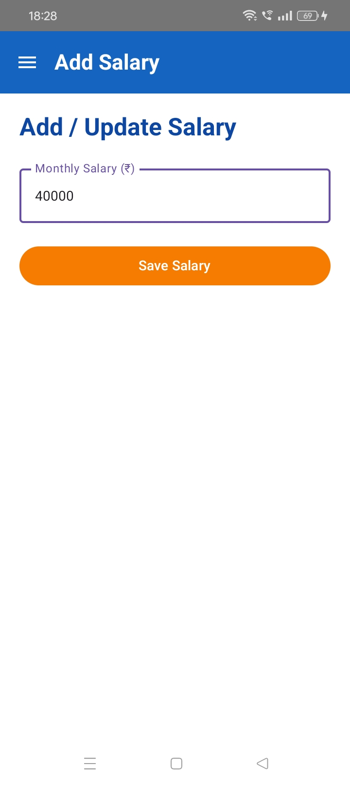

7. Add EMI
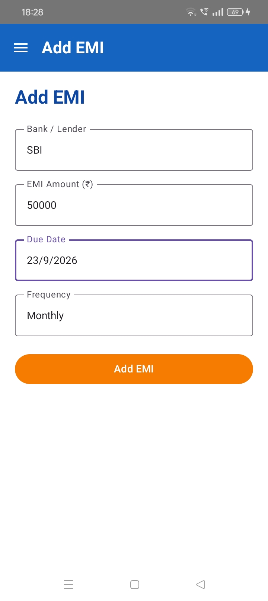

8. My EMI
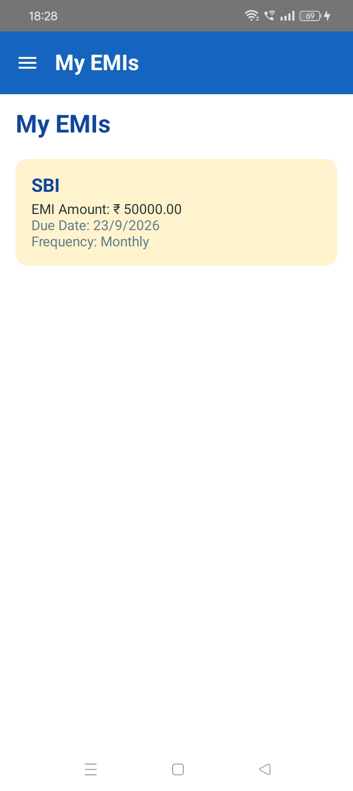

9. Financial Summary
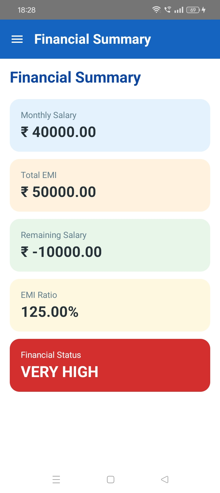

10. Add Expense – Food
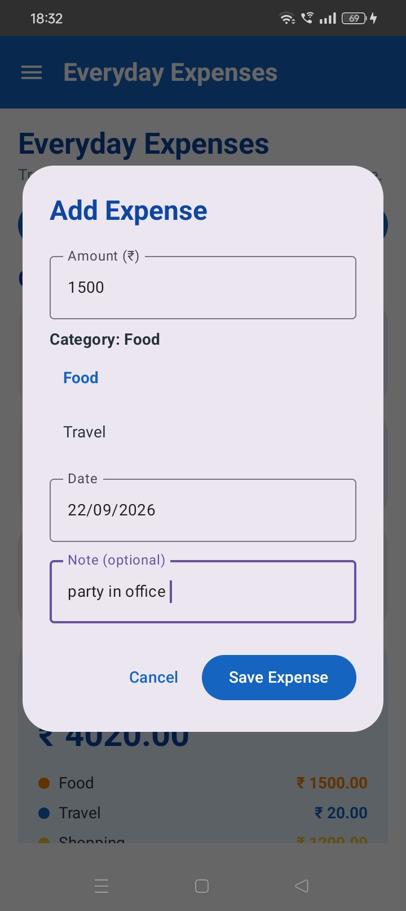

11. Add Expense – Travel

12. Add Expense – Shopping
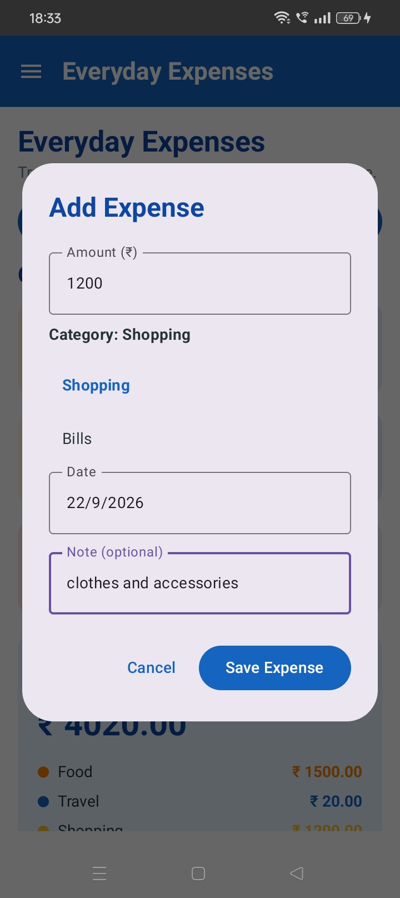

13. Add Expense – Bills
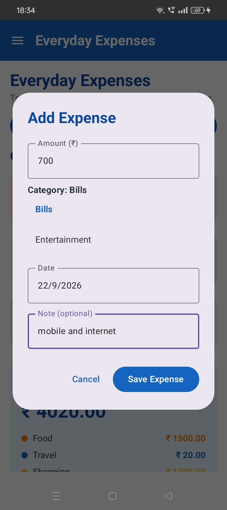

14. Add Expense – Entertainment
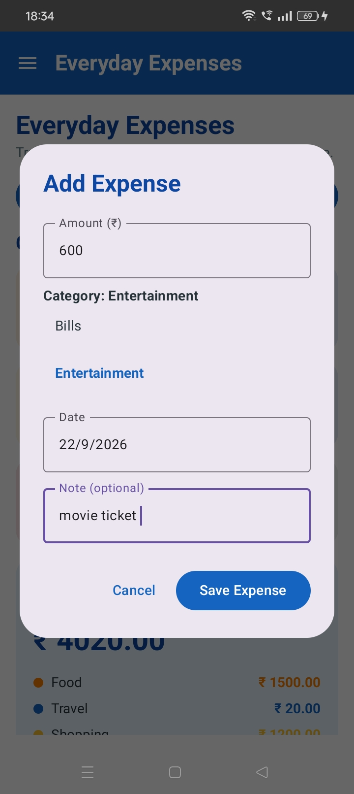

15. Everyday Expenses
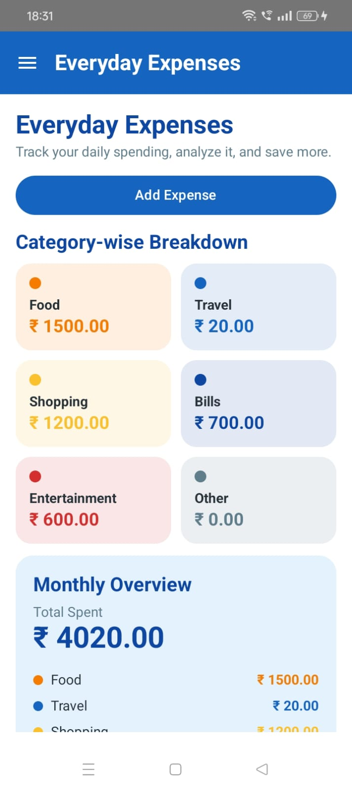

16. Everyday Expenses – More
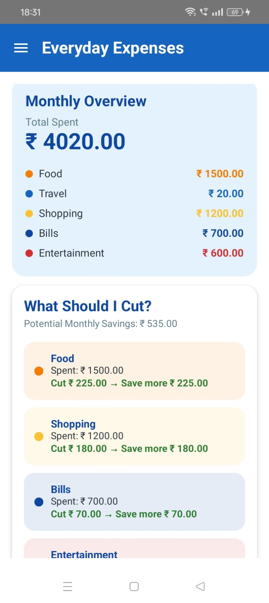

17. Everyday Expenses – Details
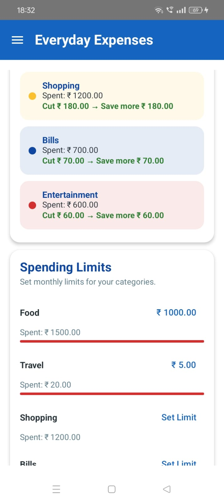

18. Everyday Expenses – Additional
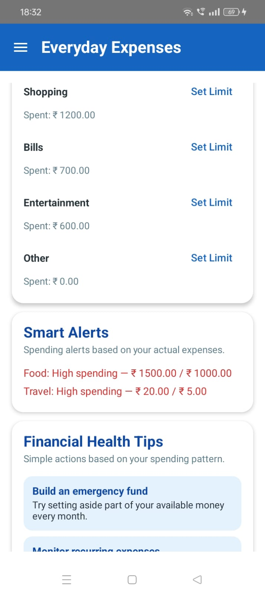

19. Everyday Expenses – More Details
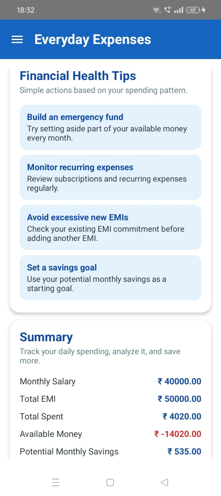

20. Everyday Expenses – Summary
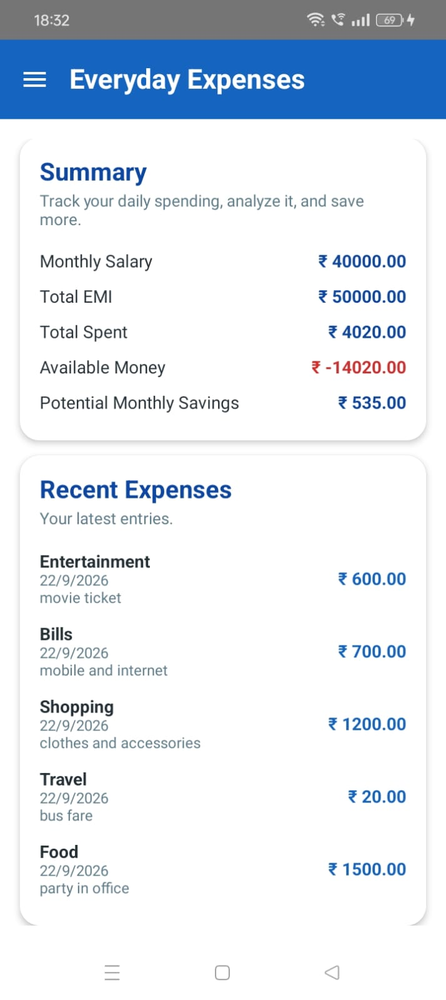

21. Profile
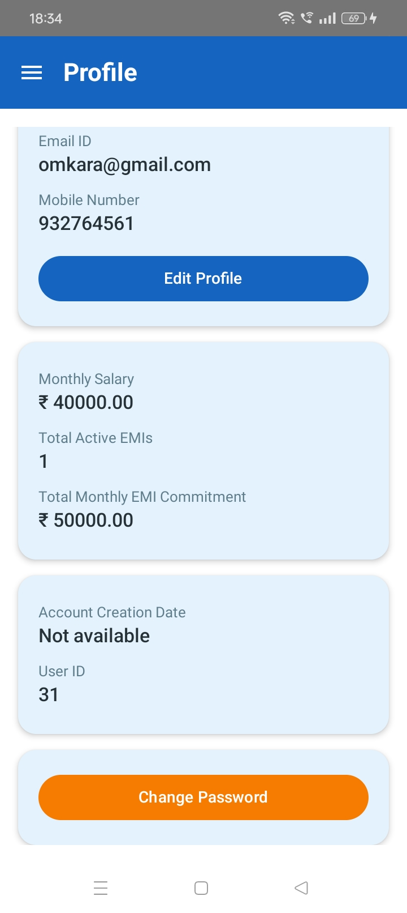

22. Profile – More

23. Settings
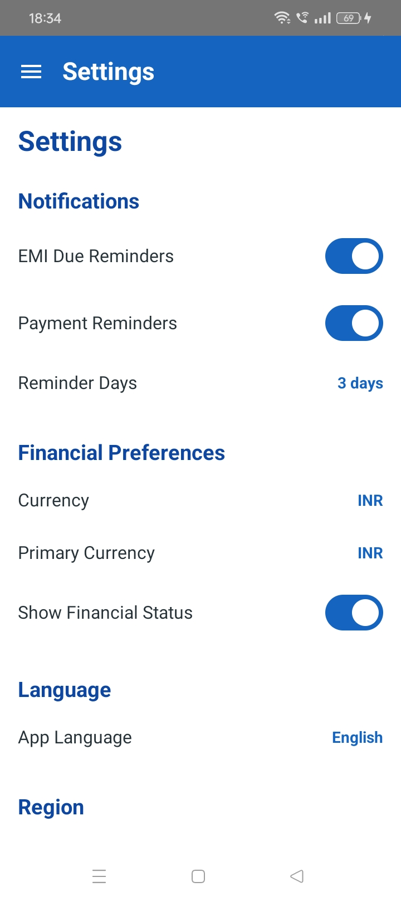

24. Settings – More
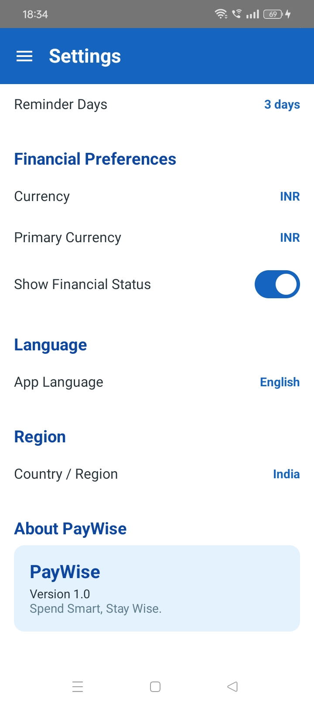

25. Menu
    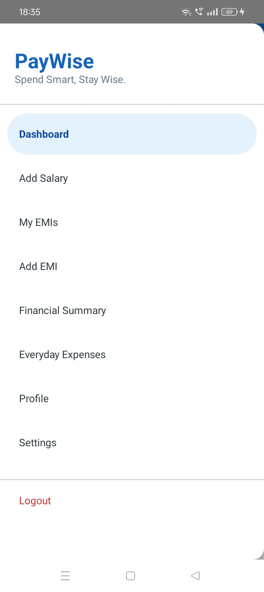

## Project Status
**PayWise MVP – Round 2**
The application is currently being developed and enhanced for the project competition.

## GitHub Repository
https://github.com/krupadiwadkar30-hub/PayWise

## Team
### PayWise Team
- Krupa Diwadkar
- Aarya Dhadve
- Anwesha Deshmukh

## Vision
Our vision is to make personal financial management simple, organized, and easy to understand.

**PayWise – Spend Smart, Stay Wise.**